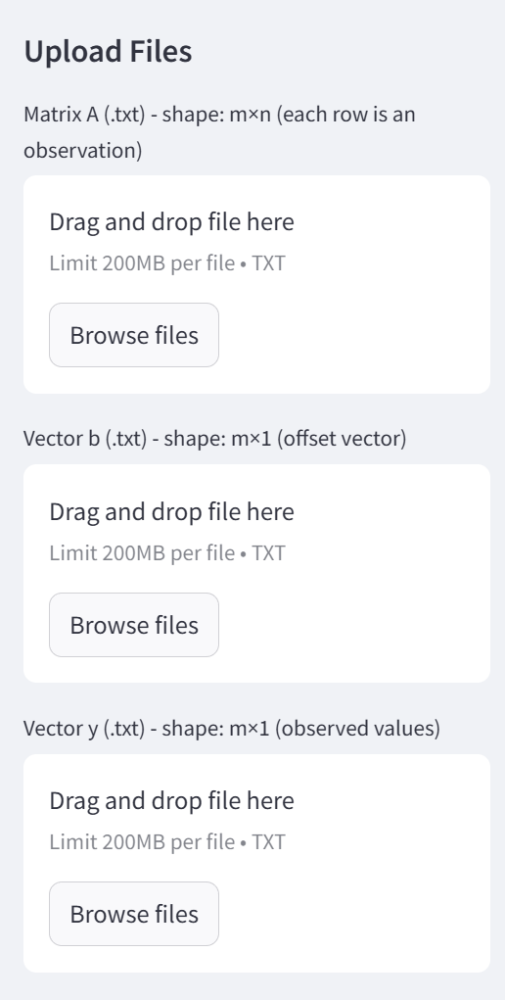
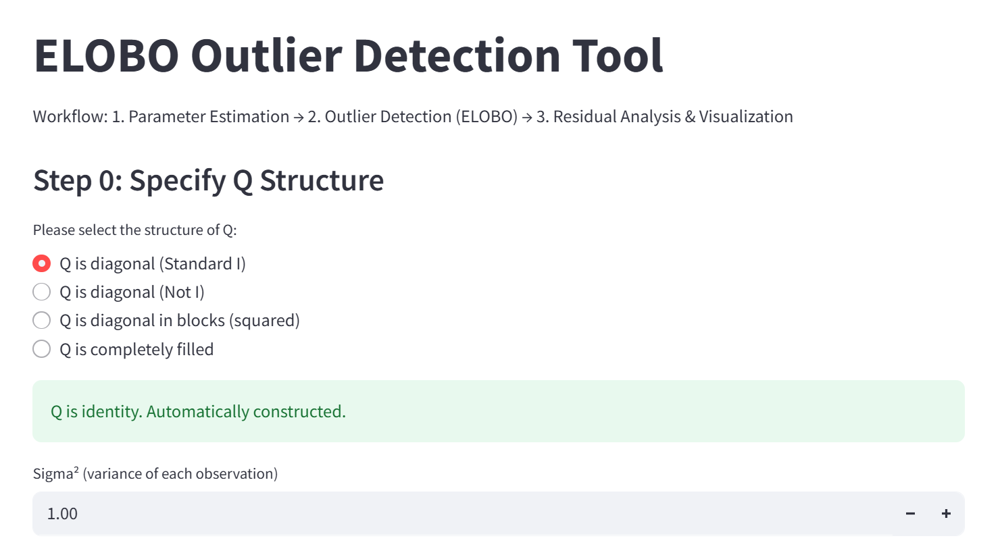
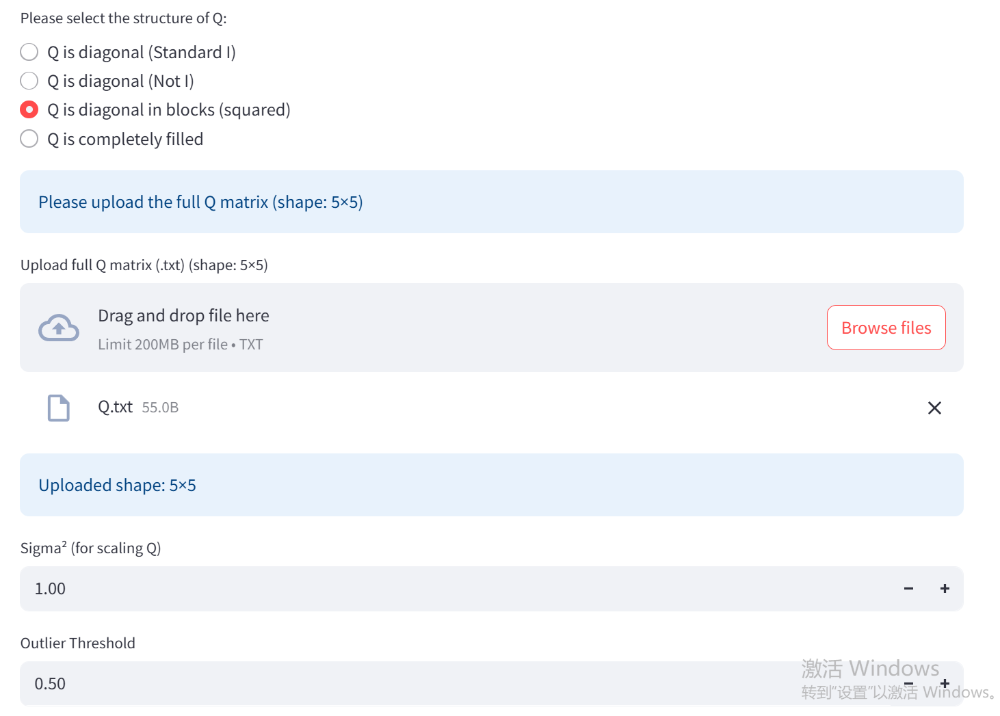
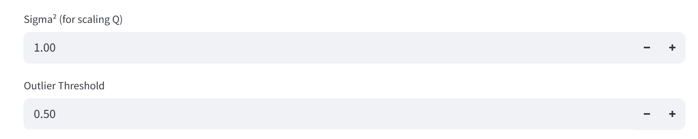
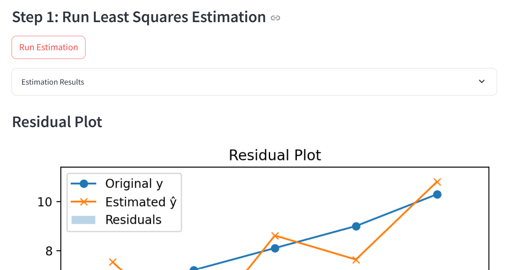
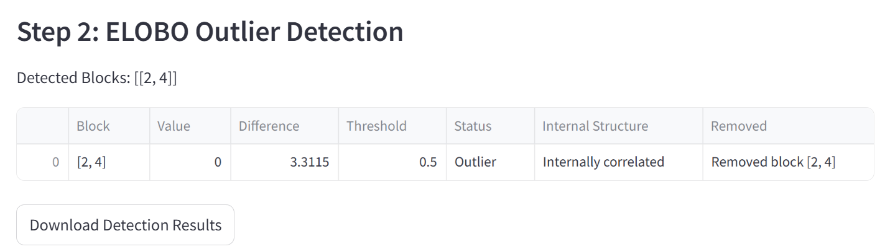
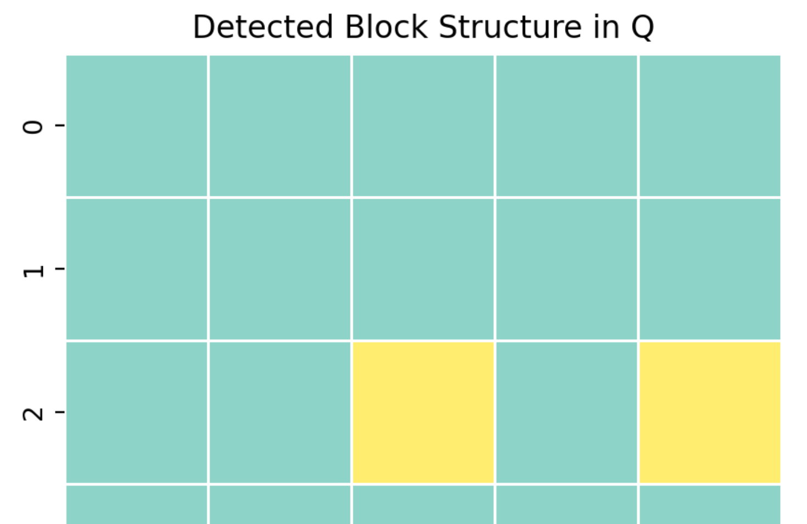
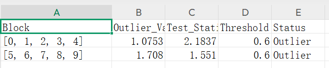

## Two-part outlier detection system
## Based on Least Squares Estimation and the ELOBO (Efficient Leave-One-Block-Out) method. 

## Features

### Part 1: Least Squares Estimation
- Automatically generates the covariance matrix Q (as identity matrix).
- Validates matrix dimensions between A (m×n), b (m×1), and y (m×1).
- Displays estimated parameters: x̂, ŷ, residuals, and estimated σ².
- Includes a residual plot to visualize fitting errors.

### Part 2: ELOBO Outlier Detection

- Divides data into user-defined blocks.
- For each block, performs leave-one-block-out estimation and evaluates the residual change.
- Detects outliers by comparing changes in residual norm with a user-defined threshold.
- Results are displayed in a table and can be downloaded as CSV.

### Part 3: Q Matrix Design
Builds an adjacency graph by treating non-zero
- 
- Q[i,j] (above a threshold) as connections between observations.
- Applies depth-first search (DFS) to extract connected components (blocks) from the graph.
- Isolated observations (not connected to any other) can be optionally ignored to avoid false detection.
- Automatically visualizes detected block structure using a heatmap.

## Requirements
Make sure you have Python 3.8+ installed. Then install these four required packages:

    pip install streamlit numpy pandas matplotlib

## How to Run
   From the terminal, run the following command inject directory:

    streamlit run elobo_project.py

A browser window will open at http://localhost:8501

## key steps

### 1.  Input File Format

Upload the following three files via the sidebar interface:
A.txt: matrix A, shape (m × n), one row per observation.
b.txt: vector b, shape (m × 1), offset term.
y.txt: vector y, shape (m × 1), observation values.
    

（If the input row and column are wrong, an error will be reported）

### 2. Choose Q Structure and Import Q & ELOBO Block Settings

After uploading the input files, the interface will guide the user to select the type of covariance matrix 𝑄

Q:Identity matrix (I)
  Diagonal matrix (heteroscedastic)
  Block-diagonal matrix
  Fully filled matrix
Users can either upload a full Q matrix or manually input values (for small dimensions).
Once Q is loaded, the interface dynamically shows the inputs for σ² (variance) and threshold (if applicable).
Note: For identity Q, threshold input is hidden.
   
   
   

### 3.Output LS estimate and residual plot

   

### 4.ELOBO Output plot

 Each block is removed once and residuals re-estimated. 
 The difference in residual norm is compared with the threshold to detect potential outliers. 
 The results are displayed in a table and heatmap.
   
   

### 5.Download ELOBO for csv，file 

   
